# Production portal — routes

Captured as `stellar.production@demo.com` at deploy `f0564b59`. Accent color: blue-indigo (`#4A5FD0`, `brand-portal-production`).

| Route | Screenshot | Source |
|---|---|---|
| `/production/dashboard` |  | `ProductionDashboard.tsx` |
| `/production/pitches` | 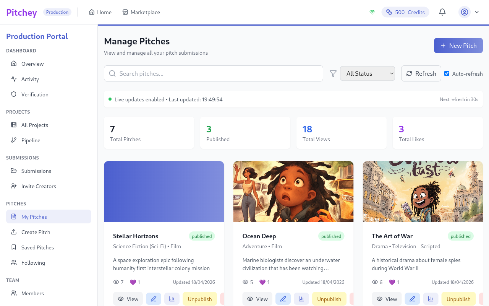 | `ManagePitches.tsx` (shared) |
| `/production/pitch/new` | 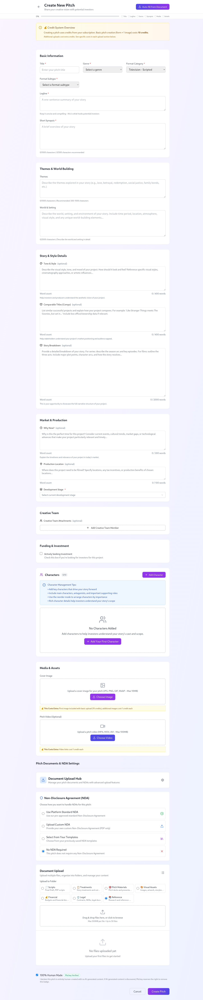 | `CreatePitch.tsx` (rendered **outside** `PortalLayout` — full-width wizard) |
| `/production/analytics` | 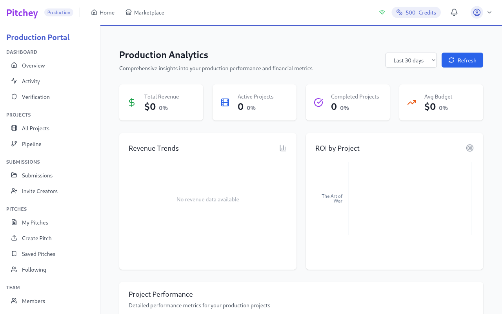 | `ProductionAnalyticsPage.tsx` |
| `/production/projects` | 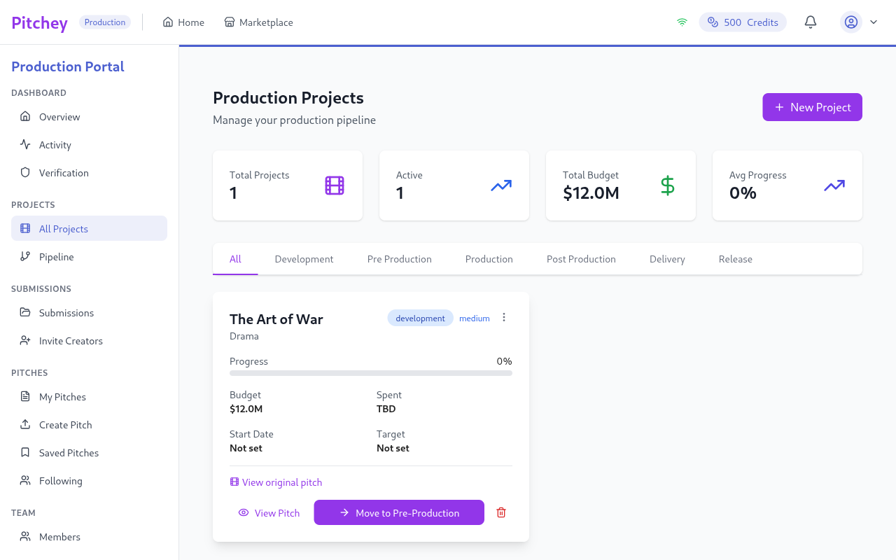 | `ProductionProjects.tsx` |
| `/production/pipeline` | 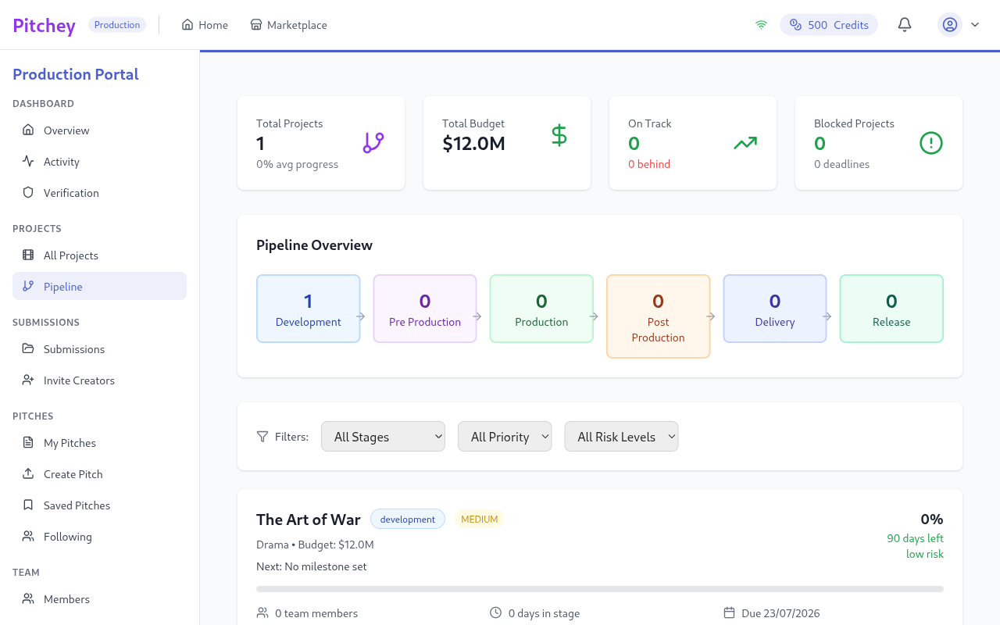 | `ProductionPipeline.tsx` |
| `/production/ndas` | 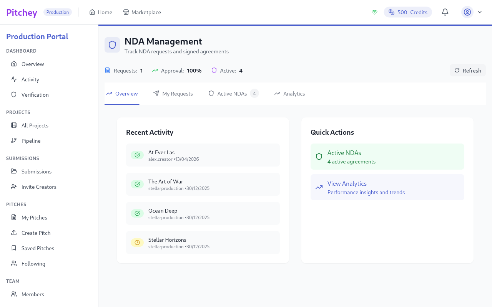 | `ProductionNDAManagement.tsx` → `ComprehensiveNDAManagement.tsx` |
| `/production/messages` | 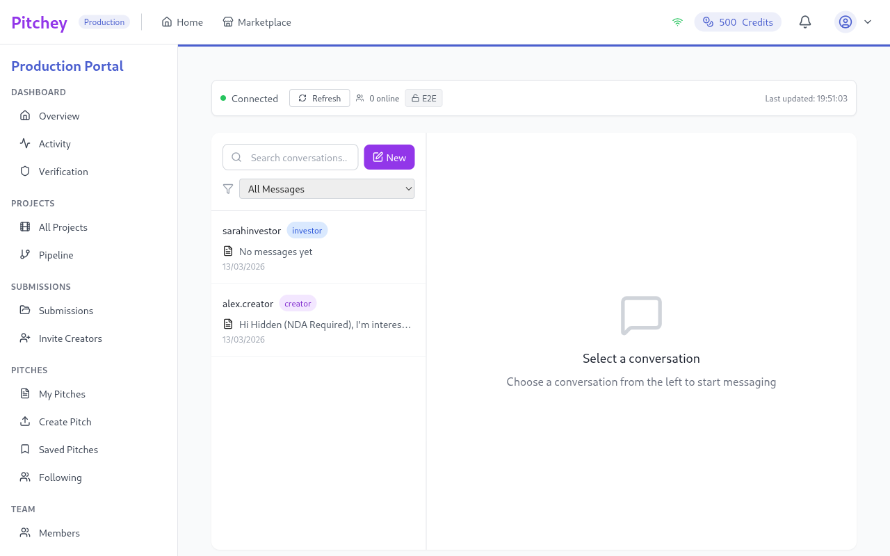 | `Messages.tsx` (shared) |
| `/production/calendar` | 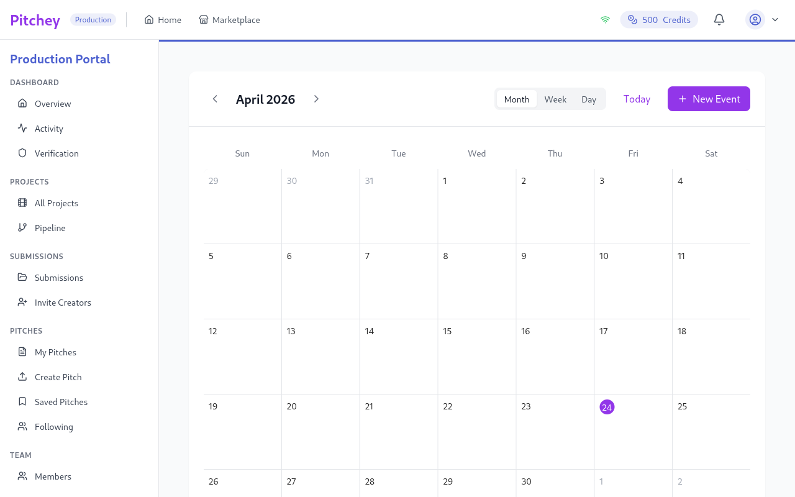 | `Calendar.tsx` (shared) |
| `/production/profile` | 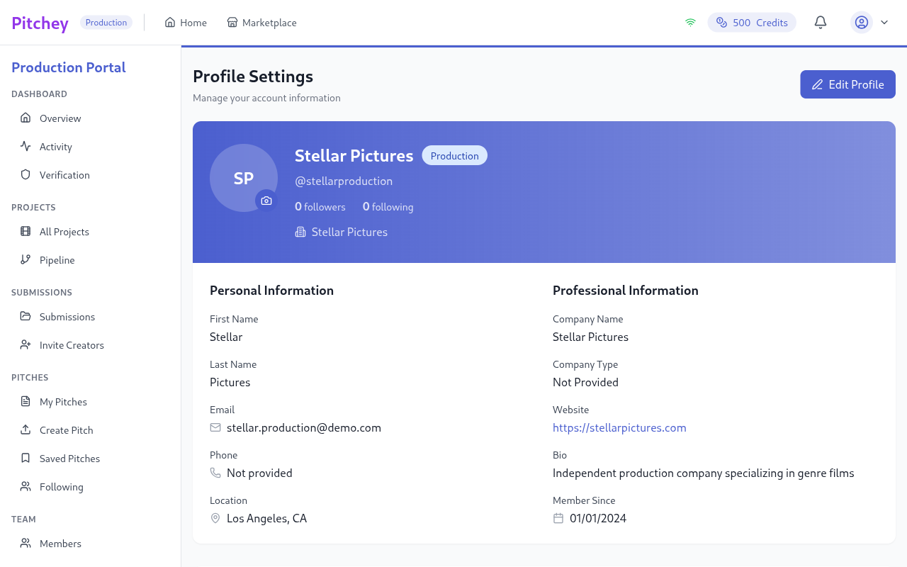 | `Profile.tsx` (shared) |
| `/production/billing` | 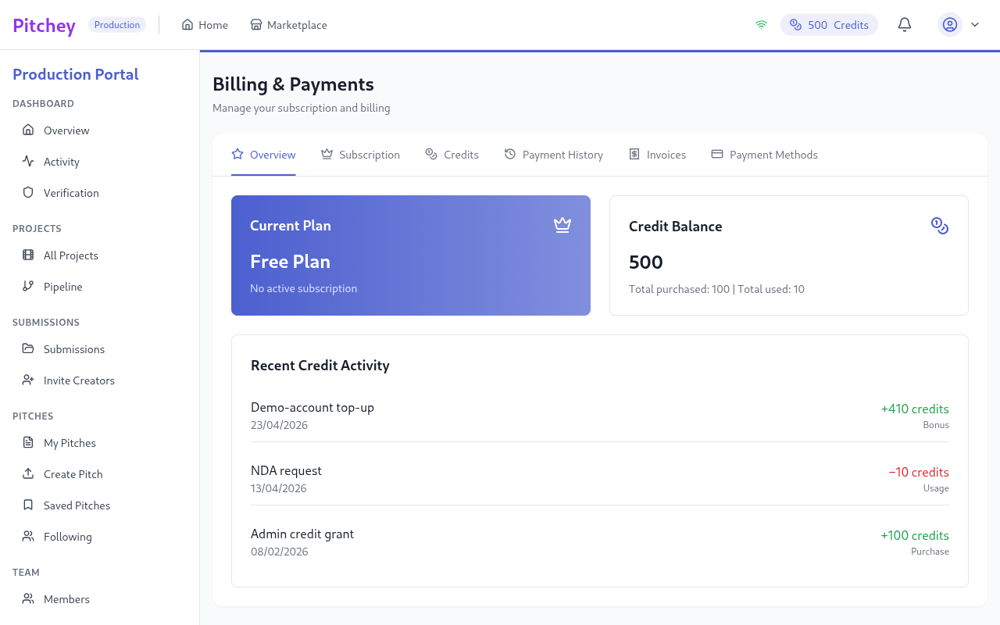 | `Billing.tsx` (shared) |
| `/production/settings` | 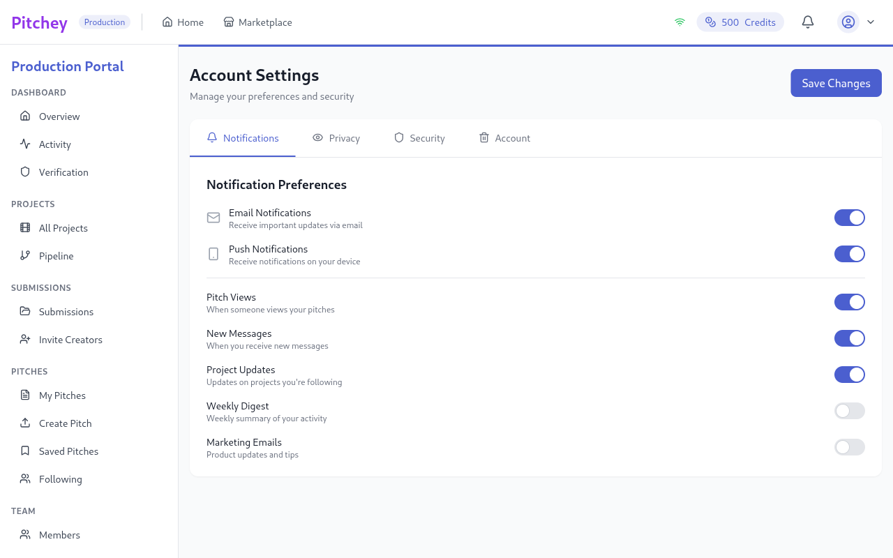 | `Settings.tsx` (shared) |

**Not captured** (per-entity or sub-tabs that depend on data):
- `/production/pitch/:id` (ProductionPitchView — rendered outside layout)
- `/production/pitches/:id/edit` (PitchEdit)
- `/production/projects/{active,development,post,completed}` (filtered views)
- `/production/submissions/{new,review,shortlisted,accepted,rejected,archive}`
- `/production/revenue`, `/production/saved`, `/production/following`
- `/production/collaborations`, `/production/my-collaborations`, `/production/invites`
- `/production/team/{members,invite,roles}`
- `/production/settings/{profile,billing,notifications,security}` (sub-tabs of Settings)
- `/production/onboarding`, `/production/verification`
- `/production/legal/*`
