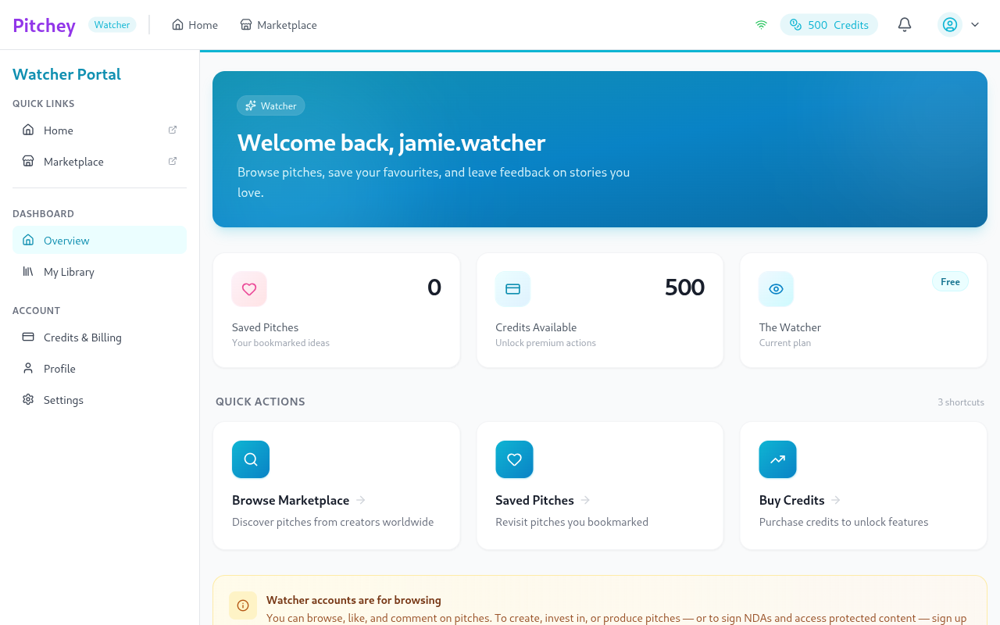
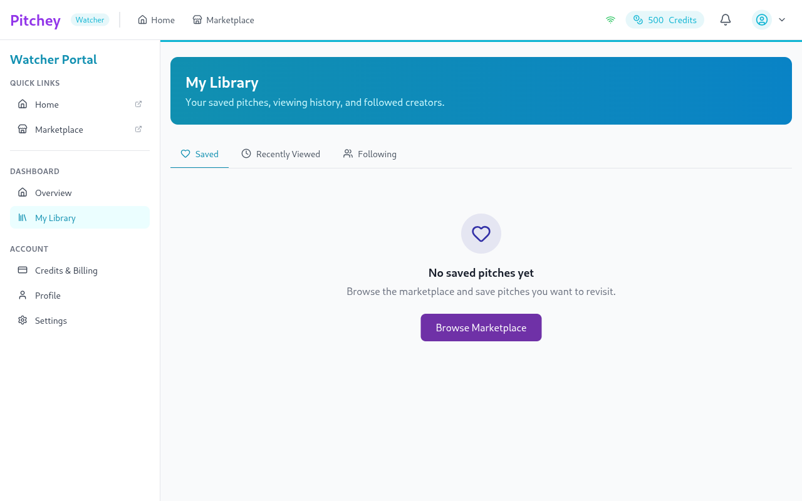
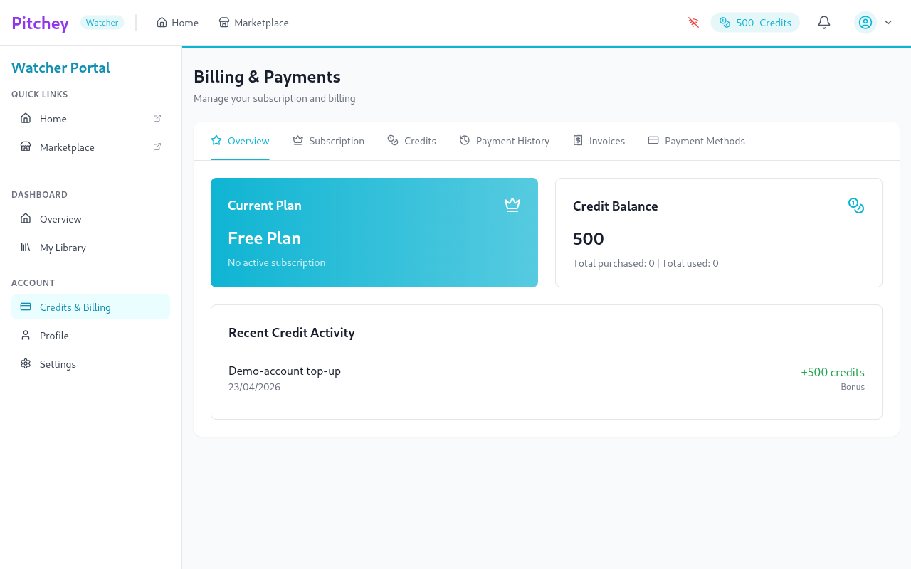
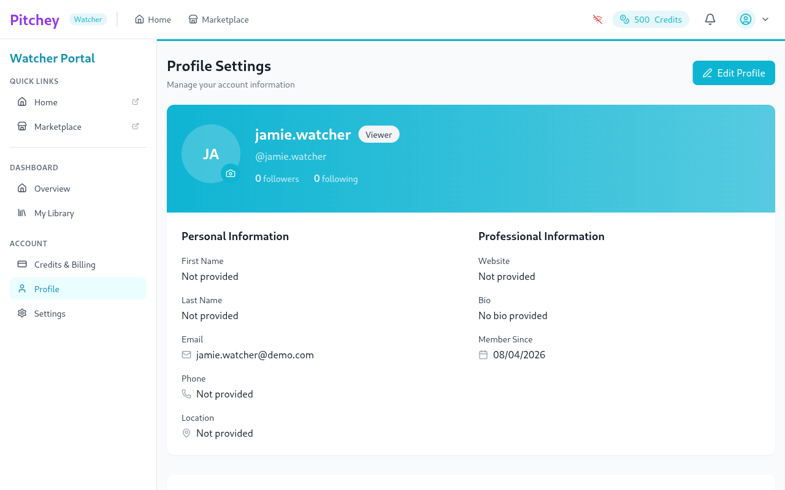
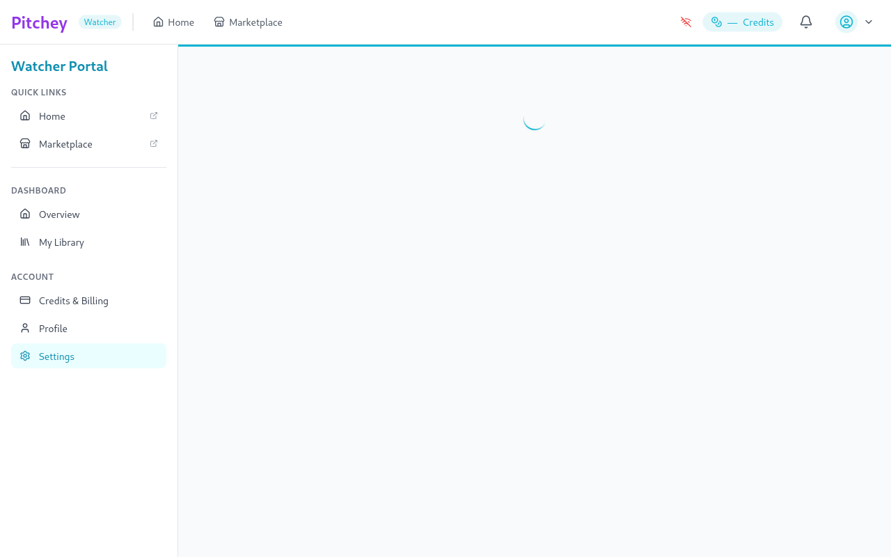

# Watcher portal — routes

Captured as `jamie.watcher@demo.com` at deploy `f0564b59`. Accent color: cyan (`#06B6D4`, `brand-portal-watcher`).

Watcher is the smallest portal — it's audience-only (browse, like, save,
comment; no pitch creation, investment, or NDA signing).

| Route | Screenshot | Source |
|---|---|---|
| `/watcher/dashboard` |  | `WatcherDashboard.tsx` |
| `/watcher/library` |  | `WatcherLibrary.tsx` (tabs: Saved / Recently Viewed / Following) |
| `/watcher/billing` |  | `Billing.tsx` (shared) |
| `/watcher/profile` |  | `Profile.tsx` (shared) |
| `/watcher/settings` |  | `Settings.tsx` (shared) |

**Legacy redirects** (not captured — same as `library`):
- `/watcher/browse` → `/watcher/library?tab=saved`
- `/watcher/saved` → `/watcher/library?tab=saved`
- `/watcher/following` → `/watcher/library?tab=following`
